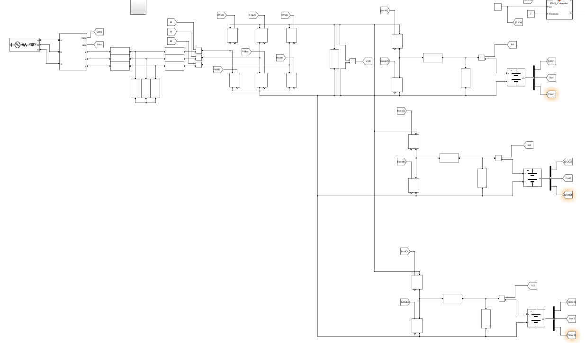
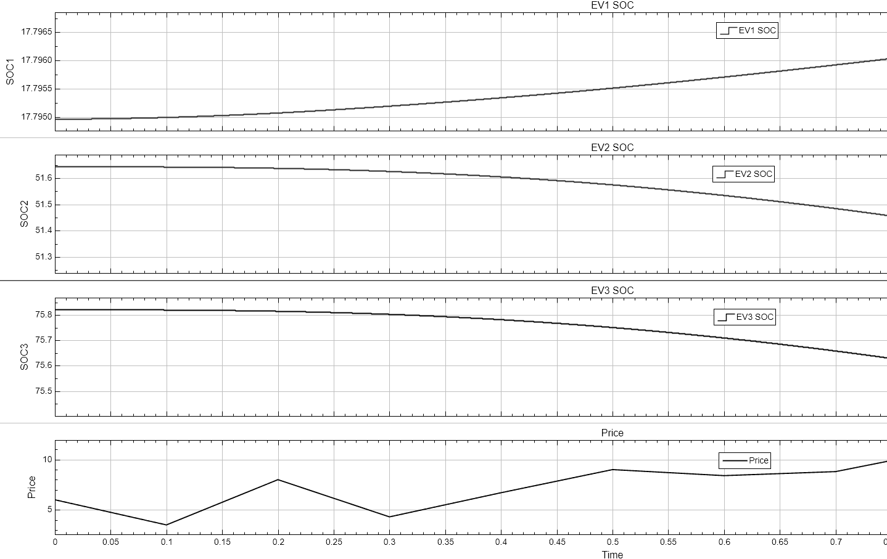
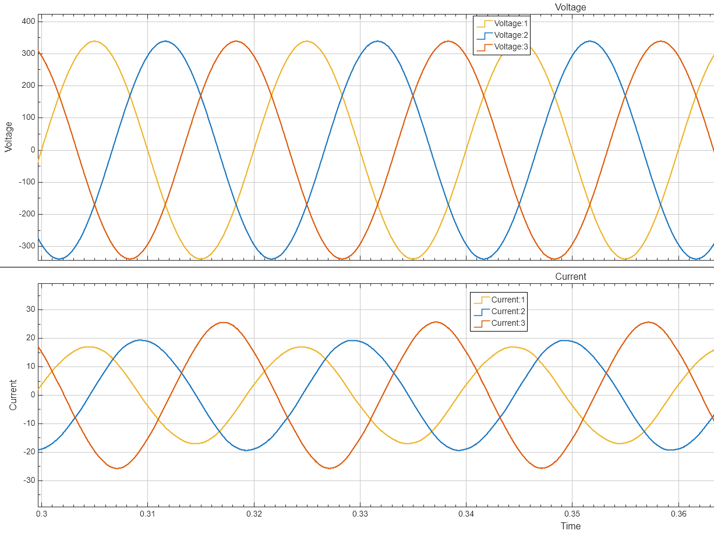

# Intelligent Bidirectional EV Charging & V2G Coordination System

### Overview
Designed and simulated a 100 kVA smart Vehicle-to-Grid (V2G) and Grid-to-Vehicle (G2V) charging station for multiple EVs. The system utilises a centralised Energy Management System (EMS) to dynamically switch between charging and discharging based on real-time grid pricing and battery State of Charge (SOC), ensuring grid stability and battery health.

### System Architecture
*(Insert your main Simulink circuit screenshot here)*

* **Grid Interface:** 415V, 50Hz 3-phase grid connected to a Voltage Source Converter (VSC) via a custom-designed LCL filter (resonance at 581 Hz) to maintain IEEE 519 compliance.
* **DC Link & Converters:** 800V shared DC bus regulating three independent 360V EV battery models through bidirectional Buck-Boost converters.
* **Control Layer:** dq-current control with a Phase-Locked Loop (PLL) ensuring Unity Power Factor during G2V and exact 180-degree current reversal for V2G active power injection.

### Key Engineering Achievements

**1. Model-Free Intelligent PI (iPI) Control**
Replaced traditional fixed-gain PI controllers with an ultra-local model-free iPI controller. 
* **Result:** Achieved **60% faster settling time** (~20ms vs 50ms) and **3x lower peak overshoot** (~4% vs 12%) during highly dynamic grid price fluctuations.

**2. Peer-to-Peer Multi-EV Coordination**
Engineered an algorithm allowing EVs to bypass the AC grid during high-price peak hours. 
* **Result:** If one EV is critically low on charge while electricity prices are high, the EMS automatically commands higher-SOC EVs to discharge into the shared DC bus to charge the depleted EV, avoiding expensive grid power purchases.

**3. Battery Health Protection (CC-CV Imitation)**
* Implemented strict 20%-90% SOC operational boundaries to prevent deep discharge and thermal runaway. 
* Designed a tapered charging law `I_max(1 - SOC/100)` that dynamically mimics an optimal Constant-Current/Constant-Voltage (CC-CV) lithium-ion charge profile.

### Performance Waveforms
*(Insert Figure 6.4 from your thesis here)*

*Figure: Multi-EV DC-bus coordination demonstrating Peer-to-Peer charging during high grid prices.*

*(Insert Figure 6.5/6.6 from your thesis here)*

*Figure: Grid-side waveforms demonstrating Unity Power Factor (PF = +1) with THD < 3%.*

### Tech Stack
* **MATLAB R2023a:** EMS logic, numerical algorithm design, controller tuning.
* **Simulink & Simscape Power Systems:** Full plant modeling, PWM modulation (10 kHz), dq-frame transformations, LCL filter simulation.
